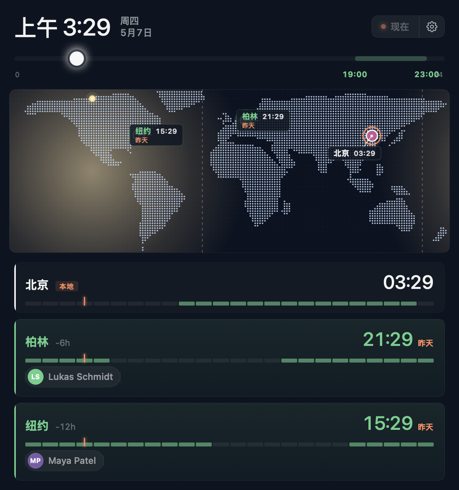
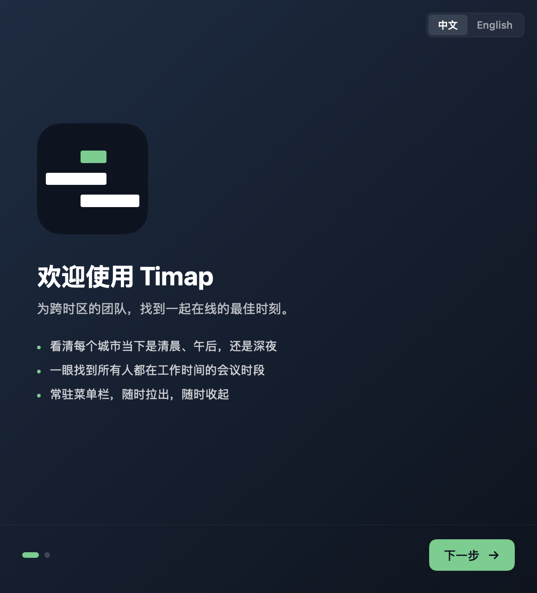
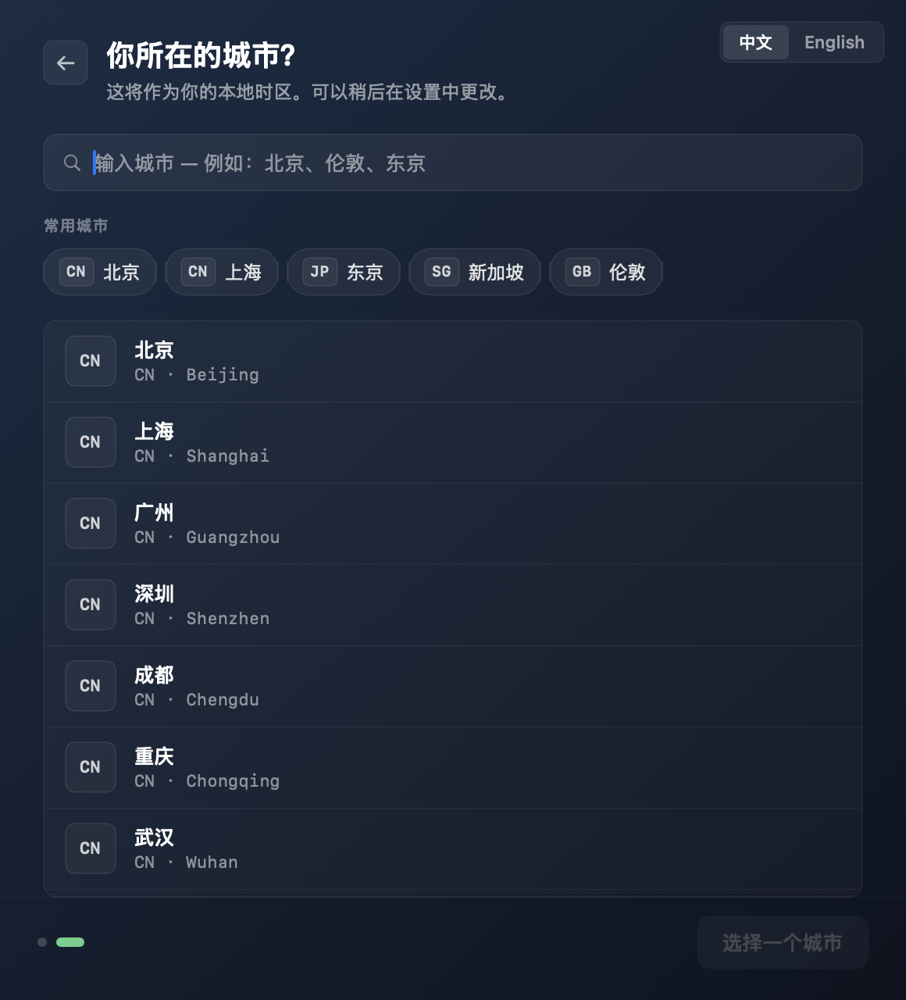
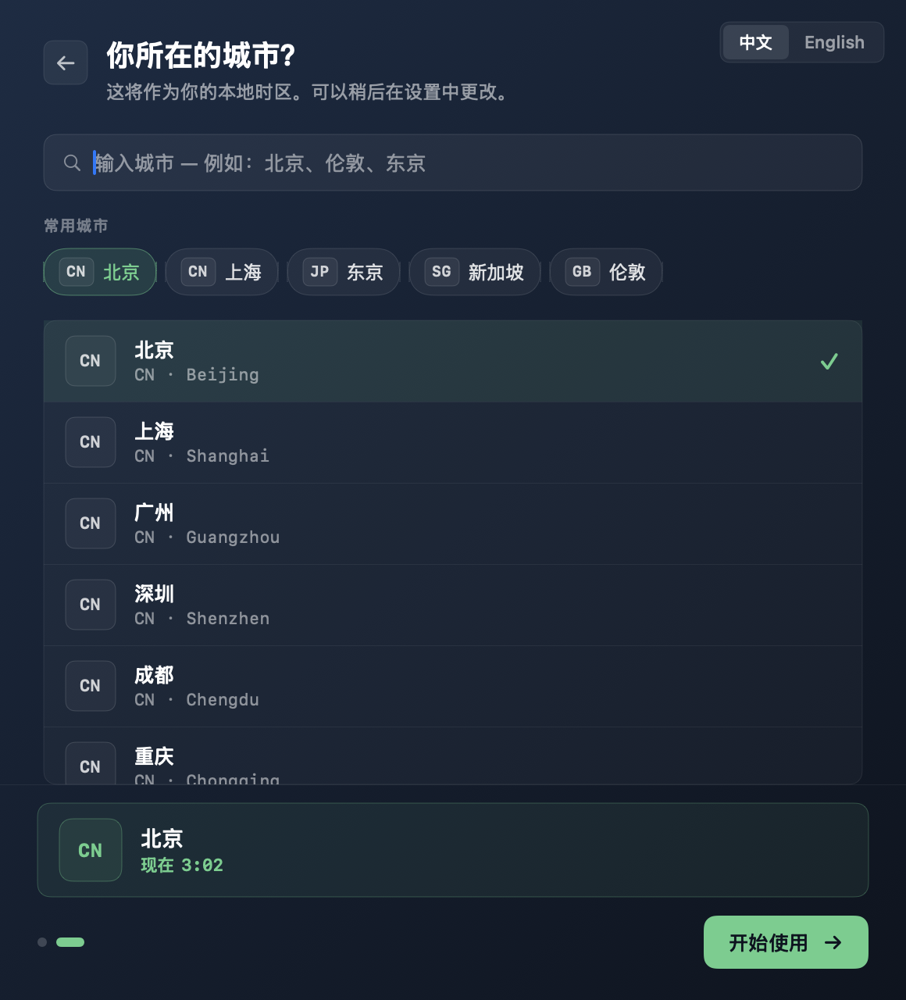
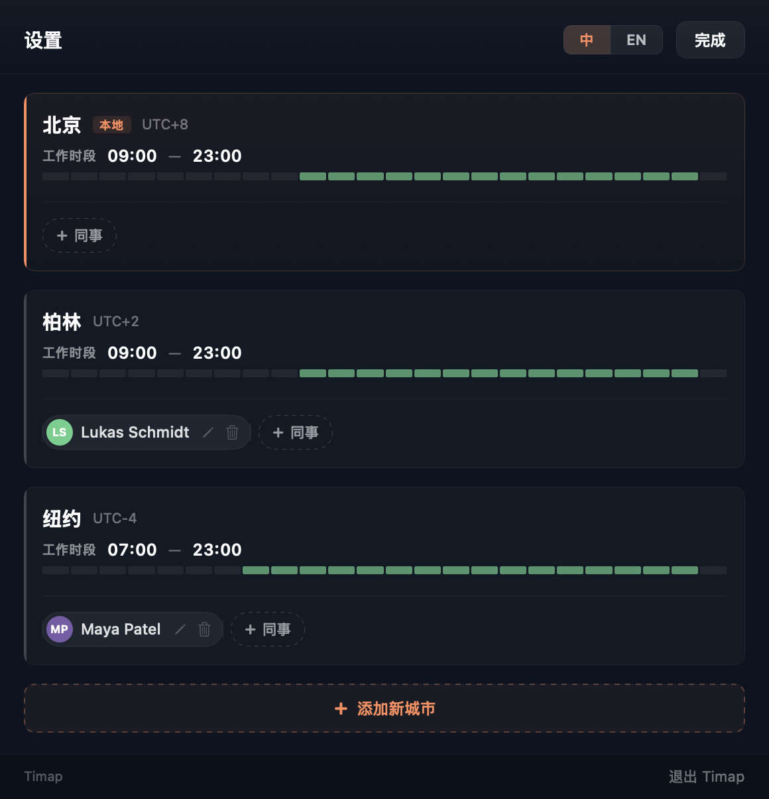

# Timap

[English](README_en.md) · 中文

   

> **一秒看见全队此刻几点。**
> 菜单栏点一下，世界地图上你的同事正在睡觉、吃午饭还是开会，一目了然。拖一下时间轴，下周二的全员会该约几点，绿色高亮自己跳出来。

<p align="center">
  
</p>

写给每天打开 Slack 前要先做三道时区算术题的人。SwiftUI · Swift Package Manager · macOS 13+。

---

## 能干什么

- **🌍 全队定位实时上图** — 一张会动的世界地图，pin 跟着昼夜走。打开 app 的那一秒，谁在深夜、谁在午休、谁刚坐到工位，一眼分得清。
- **🎚 时间轴随手拖** — 滑块一推，所有城市卡同步切换状态。"下周二北京晚 10 点，纽约的 Maya 还醒着吗？"—— 拖过去，答案在卡上。
- **✨ 自动找全员重叠窗口** — 把所有同事的工作时段以 30 分钟为步进求交集，按重叠人数和连续长度排序。点左上角时间数字，一键跳到下一个推荐窗口。
- **🌐 中英双语 + IANA 时区** — UI 双语切换，时区不是写死的 UTC+8 —— 柏林、伦敦、纽约的夏令时跳转跟着真实日期自动走。
- **🏠 安静住在菜单栏** — 没有 Dock 图标，不抢空间。需要时点开 popover，Esc 收起，点外面任何地方也收。

## 它**不**做什么

故意不做的事，避免功能蔓延：

- ❌ 日历 / EventKit 集成（只看时区，不读你的日程）
- ❌ 多日视图（只看"今天"，下周的事下周再说）
- ❌ 团队云同步（你和同事各自一份本地数据，互不通讯）
- ❌ App Store 上架（直接 GitHub Releases 分发）

## 安装

### 方式一：下载 DMG（推荐）

1. 从 [Releases](https://github.com/JVever/Timap/releases) 下载 `Timap-0.1.0.dmg`
2. 打开 DMG → 把 `Timap.app` 拖到 Applications
3. 第一次打开：右键 `Timap.app` → "打开" → 确认
4. 菜单栏顶部找到 Timap 图标，点开

<details>
<summary>遇到「无法验证开发者」？</summary>

这个 app 没花 99 美元做苹果开发者签名，所以 macOS Gatekeeper 默认会拦一次。许多 macOS 工具最初也都走过这条路 —— 右键打开一次就好。

如果懒得点鼠标，等价于一行命令：

```sh
xattr -d com.apple.quarantine /Applications/Timap.app
```

之后正常双击即可。

</details>

### 方式二：从源码构建

```sh
git clone https://github.com/JVever/Timap.git
cd Timap/Timap
make run
```

需要 macOS 13+ 和 Xcode Command Line Tools（`xcode-select --install`）。

## 三步上手

### 1. 选你所在的城市

第一次打开是欢迎页：logo 装配动画 + 三句价值主张（看清每个城市当下是清晨午后还是深夜 / 一眼找到全员都在工作时间的会议时段 / 常驻菜单栏随时拉出收起）。下一步选你所在的城市，作为本地时区。

<p align="center">
  
  
  
</p>

<p align="center"><sub>欢迎页 → 选你的城市 → 确认进入主界面</sub></p>

### 2. 添加同事

进入 Settings（齿轮图标）→ 在每张城市卡上点 "+ 同事" 加入团队成员；底部 "+ 添加新城市" 加更多城市。每位同事的工作时段可独立设置（30 分钟步进），头像支持上传图片或姓名首字母自动生成。catalog 里没有的城市可以手动添加经纬度。

<p align="center">
  
</p>

### 3. 看图办事

回主界面：

| 操作 | 结果 |
|---|---|
| 拖滑块 | 所有城市卡同步切换状态 |
| 点左上角时间数字 | 一键跳到下一个推荐会议时段 |
| 点城市名字 | 隐藏 / 包含该城市（隐藏的不参与重叠计算，但仍显示在地图上） |
| 点 "现在" 按钮 | 回到当前实时 |

## 给贡献者

一人维护，欢迎 PR / issue。

### 仓库结构

```
.
├── Timap/                         # macOS app（SPM package，不带 .xcodeproj）
│   ├── Package.swift
│   ├── Makefile                   # 所有日常命令
│   ├── Resources/                 # app 图标
│   └── Sources/
│       ├── TimapCore/             # 纯逻辑层（数据 / 时间数学 / 地理 / 持久化）— 无 UI 依赖
│       ├── Timap/                 # SwiftUI 视图层
│       └── TimapVerify/           # 断言式测试套件（替代 swift test，下面会解释）
├── prototype/                     # 设计阶段的 React/Babel HTML 原型，视觉规范源
├── logo/                          # 品牌 SVG 源稿
├── docs/screenshots/              # README 用的截图
└── CLAUDE.md                      # 详细架构 / 约定 / 避坑指南
```

### 想改东西？看这里

| 想做的事 | 该改 / 该看 |
|---|---|
| 加一座城市 | `Timap/Sources/TimapCore/Resources/cities.json` |
| 加新的 UI / 调整布局 | `Timap/Sources/Timap/Views/` |
| 调时间数学 / 持久化 / 地理 | `Timap/Sources/TimapCore/` + 在 `TimapVerify/main.swift` 加断言 |
| 加新文案 / i18n | `Timap/Sources/TimapCore/Models/L10n.swift` 同时改 zh + en |
| 改菜单栏 / Dock 图标 | `Timap/Sources/Timap/Brand/BrandIcon.swift` 或 `Timap/Resources/Timap-AppIcon.svg` |
| 调 onboarding 流程 | `Timap/Sources/Timap/Views/OnboardingView.swift` |

### 常用命令

```sh
cd Timap
make verify    # 跑 TimapCore 断言（替代 swift test 的事实测试套件）
make run       # 构建 + 启动
make install   # 拷到 /Applications
make dmg       # 打 DMG 安装镜像
make reset     # 清持久化数据，回到首启状态（开发 onboarding 必备）
```

### 为什么是 `make verify` 不是 `swift test`

macOS 上只装了 Command Line Tools（没装完整 Xcode）的环境不带 XCTest，`swift test` 跑不起来。所以仓库里有一个 `TimapVerify` executable target —— 用最朴素的 `check(condition, "name")` 模式覆盖 `TimapCore` 的逻辑分支。**改 `TimapCore` 里的逻辑请同步在 `TimapVerify/main.swift` 里加断言**，这是仓库唯一的回归测试机制。

更详细的架构、设计决策、踩过的坑见 [CLAUDE.md](CLAUDE.md)。

## License

[GPL-3.0](LICENSE) · Copyright © 2026 [JVever](https://github.com/JVever)

> Timap 是自由软件 —— 你可以自由使用、修改、分发；如果你分发修改版，得继续以 GPL-3.0 开源。
